# Diabetes
What is the probability that I can suffer from diabetes? The goal of the project is to create application which help women decide if they are in risk group.The Machine Learning model with the best accuracy in predicting diabetes disease was chosen and used.

## Table of contents
1. Introduction
2. Data Preprocessing 

## 1. Introduction

**International Diabetes Federation** refers that **463 million** people living with diabetes. There are couple of questions coming up to my mind. First of all how serious is this disease? What symptoms should pay my attention? Finally, the most important question -  what is the probability that I can suffer from diabetes? 

I decided to do some research on this and present key figures which I found on International Diabetes Federation site: (https://idf.org/aboutdiabetes/what-is-diabetes/facts-figures.html)

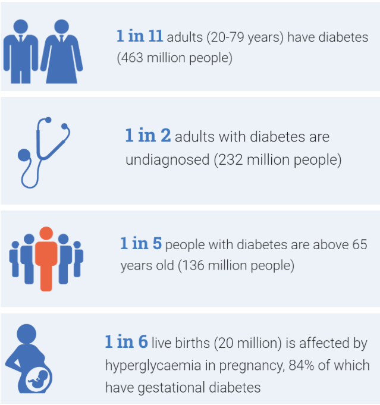 

To answer to those questions we should explain what diabetes is. The situation when the **pancreas** is no longer able to make **insulin** leads to **chronic disease which is called diabetes**. 

There is another question what is the insulin and why it is so important for us? We know that to do some stuff we need energy, which is produce by our cells. How does it work? The cells need our help, they need some ‘fuel’. Ok, so let’s do this, we can eat some glucose-rich food. What is next? How our cells absorb it from food which we ate? This is the role for insulin, a hormone made by the pancreas, letting glucose from the food we eat pass from the bloodstream into the cells in the body. If we are not able to produce insulin, the glucose levels in the blood raised leading to hyperglycaemia. In the long term high glucose levels can lead to irreparable damage to our body. 

There are three types of diabetes:
- **Type 1** - body produces very little or no insulin, occurs most frequently in children and adolescents
- **Type 2** - body does not make good use of the insulin that it produces, more common in adults
- **Gestational diabetes (GDM)** - consists of high blood glucose during pregnancy and is associated with complications to both mother and child.

To answer the last question and calculate  the probability that I can suffer from diabetes, I decided to use Machine Learning to help me predict Diabetes. It is the Machine Learning classification problem with two clasess: diabetes and non-diabetes. To summarize the performance of a classification algorithm I will be using accuracy, confusion matrix, recall, precision, F-measure.

## 2. Data Preprocessing

### Data Description

The Diabetes dataset was gathered from National Institiute of Diabetes and Digestive and Kidney Diseases. All patients are females at least 21 years. This dataset consists of several medical variables: 
* **Pregnancies** - number of times pregnant  
* **Glucose** - plasma glucose concentration a 2 hours in an oral glucose tolerance test   
* **Blood Pressure** - diastolic blood pressure (mm Hg)  
* **SkinThickness** - triceps skin fold thickness (mm)  
* **Insulin** - 2-Hour serum insulin (mu U/ml)  
* **BMI** - body mass index (weight in kg/(height in m)^2)  
* **DiabetesPedigreeFunction** - diabetes pedigree function  
* **Age** - age (years)  
 and one target variable named 'Outcome'. 

### Data Exploration

The most important step in Machine Learning is to explore dataset in order to get to know features and to see if data cleaning or data transformation is needed.
In this project Python and data science related packages such as _pandas_, _numpy_, _seaborn_, _matplotlib_ were used. 

As was noticed using _info()_ function there are 768 entries without missing values, but more detail information was obtained as a result of _describe()_ function. 

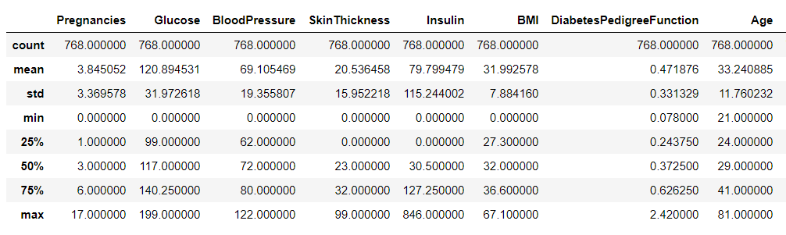

Despite the fact that there are no missing values, the above statistics indicate potential errors. As was presented above majority of data have minimum value equal to 0. In some cases this situation might be realistic for example number of pregnancies, but features like _Blood Pressure_ or _Skin Thickness_  cannot be equal to 0.

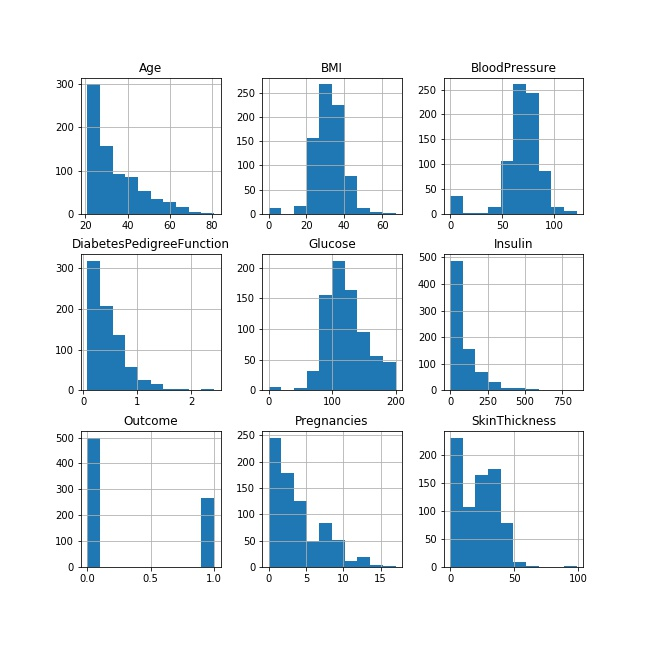 

It is very rarely possible to have 0 insulin, but there is a total of 374 counts so it suggests that they can be treated as incorrectly entered values. Additionally,  plasma glucose levels whould not be as low as zero and it is rather impossible to have BMI close to zero.

### Data Preparation

There are some methods to deal with missing values. They can be removed as enire row but we can loose valuable information. The second way is to input average/mean values instead of missing values. In some cases it can be helpful but it can send a wrong signal to the model. Features with missing values can also be removed from the model but it is not the best idea and it might have negative impact on the model. It seems that the best solution in this case is to use some built-in methods to deal with missing values. There are some models which can be used but they require 'NaN' values. It is necessary to replace _zero_ values in *"Glucose", "BloodPressure", "SkinThickness", "Insulin", "BMI"* columns.  
In this project **MissForest** method was used to impute missing values using _Random Forests_ in an iterative fashion. It does not require normalization, but all categorical data should be one-hot-encoded. Features distribution after replacing missing values are presented below.

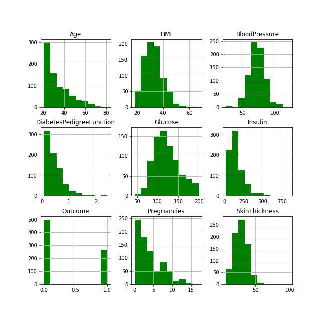 

Analyzing histograms it can be noticed that there are some outliers and the better way to see outliers is to prepare boxplot for each feature.

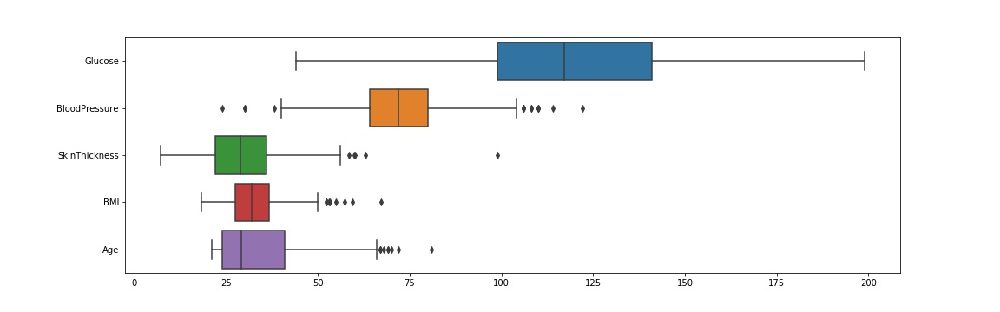 
It seems that there is no outlier for _Glucose_. The rest of features have outliers.
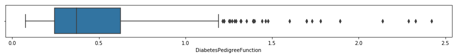 
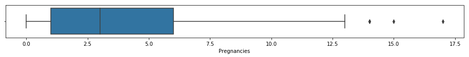 
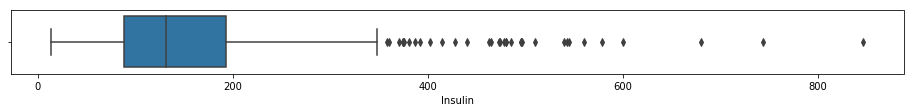 

Based on correlation matrix it can be noticed that the most correlated features with _'Outcome'_ variable are _Glucose_, _Insulin_ and _BMI_.

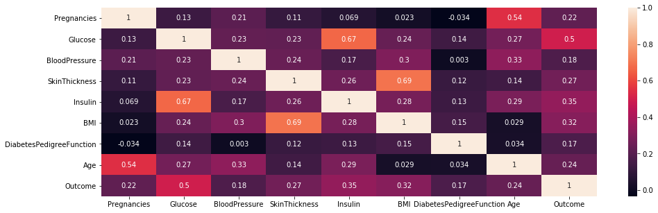

Finally, 'Outcome' variable also was analized to see how many people in dataset are diabetic.  
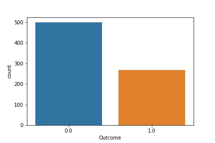 
 To sum up exploration process two main issues were found: outliers and unbalanced dataset.  

### IQR & SMOTE method

There was the two-step methodology applied to reduce classification bias towards a class in the training dataset and manage the outlier instances. This approach was described in *Artificial Intelligence in Medicine* article entitled *Efficient treatment of outliers and class imbalance for diabetes prediction* (authors: NonsoNnamoko and Ioannis Korkontzelos). Whole article can be find here: (https://www.sciencedirect.com/science/article/pii/S093336571830681X).
This method consists of two steps:
*  Searching  for outliers in the original training data using IQR algorithm and oversampled them with replacement.
*  Using SMOTE algorithm to even the class distribution before classification.

*The Interquartile Range (IQR)* algorithm was used to detect outliers in Diabetes dataset. In this method the first and the third quartiles need to be calculated and then the Interquartile range for each column was calculated. If data instances fall below Q1 − 1.5 IQR or above Q3 + 1.5 IQR they are treated as outliers.There were 92 outliers instances identified. Then all outliers were oversampled with replacement and subsequently added back to the original data. To oversample data all columns need to be scaled because oversampling method was used distance based methodology. In the end there were 952 instances, so 184 records were created.   

The second step was to obtained balanced dataset. It was done using *Synthetic Minority Over-Sampling Technique (SMOTE)* an oversampling method SMOTE which creates new artificial instances using knowledge about neighbours that surround each sample in the minority class. Thanks to this method dataset was balanced with 585 instances in both classes.

## 3. Data modeling and validation.

There were four different classification models implemented:

* Support Vector Machines (SVM) model
* Naive Bayes
* Decision Tree Classifier
* Random Forest Classifier

To evaluate models and ensure that the results are unbiased k-fold cross validation was applied. Exact folds generated from orginal data were taken to evaluate classifier models trained with preprocessed data. Training process was illustrated below: 

The four performance metrics were used to evaluate and compare different models: *accuracy, precision, recall* and *f1 score*. The results of calulated metrics for each model are presented below:

| Model         | Accuracy | Precision | Recall  | F1 score |
|---------------|----------|-----------|---------|----------|
| SVM           |   0.81   |    0.62   |   0.82  |   0.74   |
| Naive Bayes   |   0.76   |    0.55   |   0.64  |   0.65   |
| Decision Tree |   0.80   |    0.62   |   0.86  |   0.74   |
| Random Forest |   0.81   |    0.63   |   0.87  |   0.75   |

The best *accuracy* (81 %) was for **SVM model** and **Random Forest Classifier**. *Precision* metric indicate how often it is correct when the model predicts positive (class marked as '1').  
**Random Forest** has the highest precision equal to 0.63. *Recall* metric represents ratio of true positives to total (actual) positives in the data. In case of Diabetes this metric is crutial because the occurrence of false negatives is unacceptable rather than the occurrence of false positives. The highest recall was calculated for **Random Forest Classifier**. This model was selected as the most accurate to predict diabetes. 
Value of *F1 score* might be a confirmation that the best model was choosen. F1 score is equal to 0.75 and it is the highest value among all classifiers used.

### Random Forest Classifier

**Random Forests** creates *Decision Trees* on randomly selected data samples, gets prediction from each tree and selects the best solution by means of voting. The aim of *Decision Tree Classifier* is to predict class by learning simple decision rules inferred from training data. It starts from the root of the tree and compares the values of the root attribute with the record’s attribute and then follows the branch corresponding to that value and goes to the next node. The default number of trees (100) was choosen and criterion was set to 'gini' (it is default). Max depth was set to 5.

There was one tree selected from the forest and visualize below as an example:

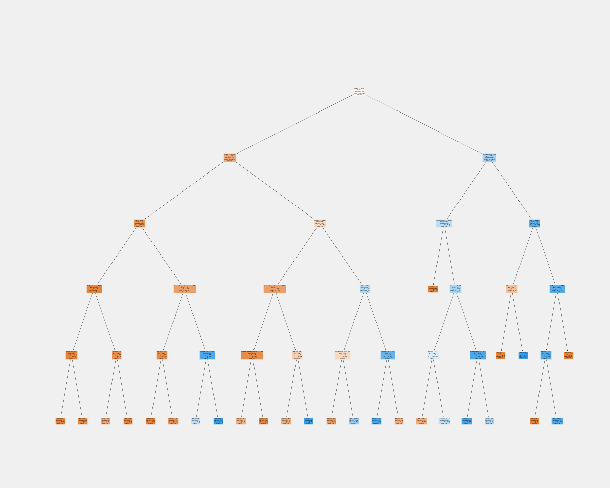

Variable importances indicate how much including a particular variable improves the prediction. The most important variable is *Glucose* with almost 0.3 importance score. Variables above 0.1 importance score are *Insulin, BMI and Age*. *Skin Thickness, DiabetesPedigreeFunction, Pregnancies and Blood Pressure* have feature importance score below 0.1.

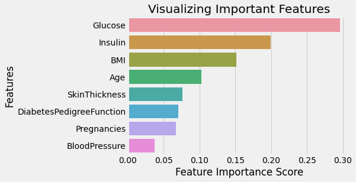

Random Forest Classifier was saved as prediction model and it was used in web application.
